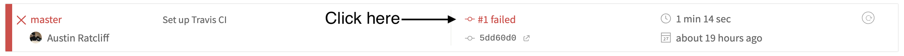

# A Father's Lullaby

### To run locally

* Clone this repo to your local device
* `cd` into the repo directory
* Run `npm install` (only for the first time you run the app)
* Run `npm start`

### To commit and push

* First, push to the `master` branch (this branch is the one that's connected to our staging environment):
  1. Make your changes on the `master` branch
  2. Lint your code by running `npm run lint:fix` and continue only if they pass
  3. [Run all tests](https://github.com/thoughtworksarts/a-fathers-lullaby#to-run-tests) and continue only if they pass
  4. `git add [your changed files]`
  5. `git commit -m "[Card  #][Your name] Your commit message`
  6. `git pull --rebase`
  7. [Run all tests](https://github.com/thoughtworksarts/a-fathers-lullaby#to-run-tests) and continue only if they pass
  8. `git push`
* Second, push to the `release` branch (this branch is the one that's connected to our production environment):
  1. `git checkout release`
  2. `git merge master`
  3. `git push`
* Checkout to the `master` branch again (`git checkout master`) and check the [CI pipeline builds](https://travis-ci.org/thoughtworksarts/a-fathers-lullaby/builds)
* If the build passes, you're done!
* If the build fails, click the link highlighted below to read the errors, fix the issue, and commit/push the fix by following the instructions above

### To run tests

* Jest and Enzyme, ie. unit/component tests
  1. Run `npm test` to launch the tests in watch mode
  2. Type `a` to run all tests
* Cypress, ie. end-to-end (E2E) tests
  1. Run `npm install` (only for the first time you run the E2E tests)
  2. Run `npm start` to run the app so that Cypress can access it at localhost:3000
  3. In a different terminal tab/window, run `npm run cypress` to launch the Cypress app and click the `▶️ Run all specs` button
  4. To run the E2E tests in the terminal without running the Cypress app, skip steps #2 and #3, and run `npm run cypress:headless`

### Package management
* Packages are managed using yarn
* To install a new package, use `yarn add package-name`
* To make sure all pagages are installed locally, run `yarn install`

### Our CI pipeline and environments

When code is pushed to the `master` branch, you can view that code at our staging environment, hosted via Surge.

🔖_Bookmark me —_ The URL is in our team tech docs

When code is pushed to the `release` branch, you can view that code at our production environment, hosted via GitHub Pages.

🔖_Bookmark me —_ https://thoughtworksarts.io/a-fathers-lullaby

Both environments run through our CI pipeline via TravisCI, so for both environments, you can view pushed code __only__ if all of the tests pass in the pipeline. You can view our pipeline here: https://travis-ci.org/thoughtworksarts/a-fathers-lullaby/builds
