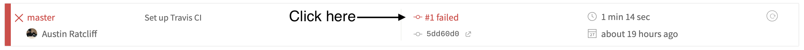

# A Father's Lullaby

### To run locally

* Clone this repo to your local device
* `cd` into the repo directory
* Run `npm install` (only for the first time that you run the app)
* Run `npm start`

### To commit and push

* First, push to the `master` branch:
  1. Make your changes on the `master` branch
  2. `git add [your changed files]`
  3. `git commit -m [your commit message]`
  4. Run all tests (`npm test a`) and check that they pass
  5. `git push`
* Second, push to the `release` branch (this branch is the one that's connected to our CI pipeline):
  1. `git checkout release`
  2. `git merge master`
  3. `git push`
* Checkout to the `master` branch again (`git checkout master`) and [check the CI builds](https://travis-ci.org/thoughtworksarts/a-fathers-lullaby/builds)
* If the build passes, you're done!
* If the build fails, click the link highlighted below to read the errors, fix the issue, and commit/push the fix by following the instructions above

